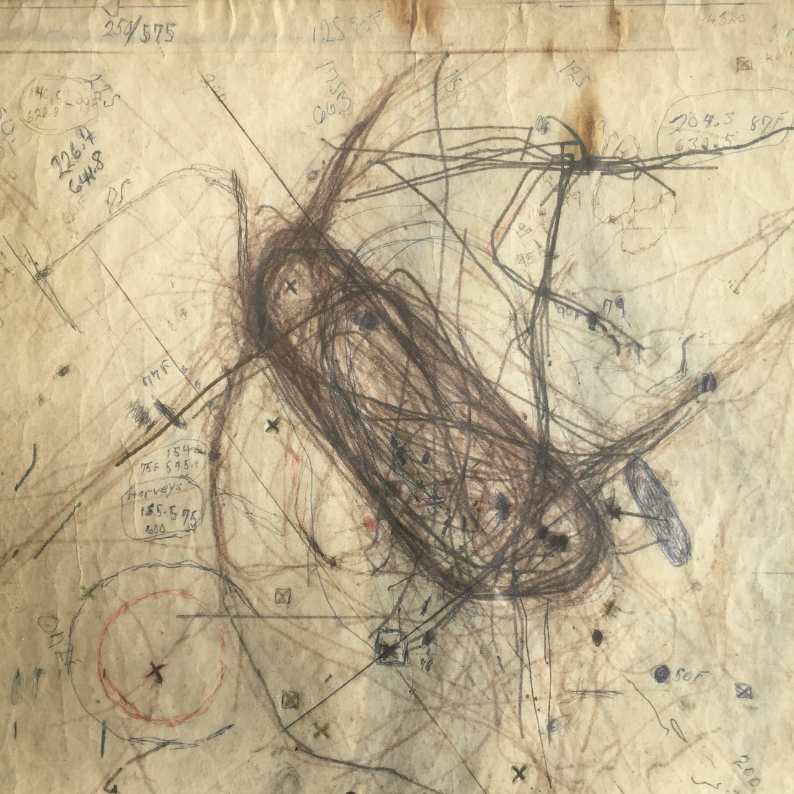
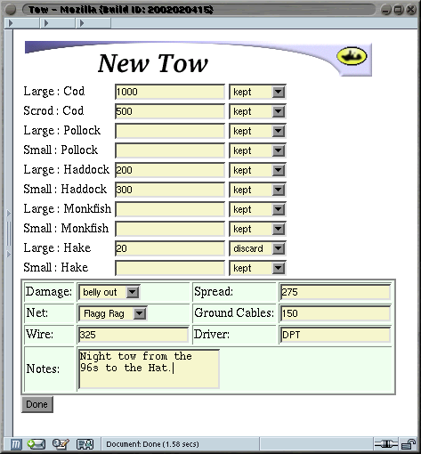
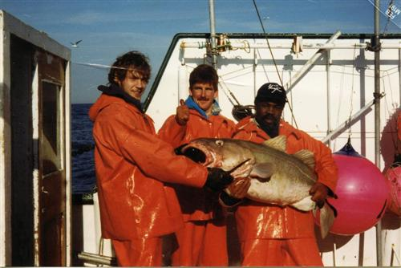

# Fisheries Management for the New Millenium!

Here's a software package I created in 1999/2000 for a series of grant proposals that never fully panned out. 

It is old school cool C++ and X-Windows. 

The old project site on SourceForge: (http://contour.sourceforge.net/)

I used bathymetric data to create pretty (though admittedly garish) visualizations of the
ocean bottom (which is the important thing when you are dragging a giant net behind you in 600' of water). 

It integrated with GPS to provide tracklines showing where you were and where you had been:

 

This was similar UI to the paper and ink plotters many boats used which created rice paper plots like this:

The catch reporting used one of the original browser engines:

In case you hadn't guessed, I got sidetracked in my early 20s and was a fisherman. Here is me on the Andrea Gail, the boat from the Perfect Storm, in the February before it sank:

